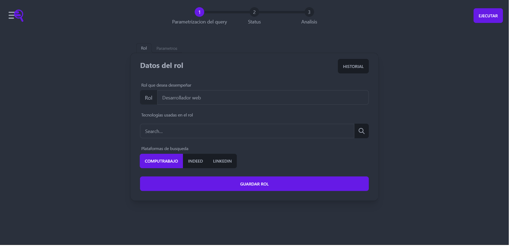

## 

An open-source platform for job data extraction in multiple plataforms and metric generator for datasources, it includes tag detection, with fuzzy search or ai.

It comes with an intuitive web ui that leets you manage all your scheduled jobs, datasources and analytics

## Features

- Hot-swap datasources
- MongoDb support
- Computrabajo support
- Tag detection
- Metric generation
  - Salary mean
  - Salary std deviation
  - Tag count

## How to run

The project includes a docker compose definition which runs the app with the required services (mongodb).

You just have to install **docker** and run the following commands:

```sh
docker compose build
docker compose up
```

## Demo

You can see a demo of the app in the following link: [Go to demo](https://youtu.be/hYKSo_WblS4), this demo doesn't include the job scheduling feature.

## Usage

1. Execute a query
   - Click "Query parameters" on the roadmap in the navbar
   - You will now be in the query parameters form, fill it
   - Execute the query with the button on form submission
2. Wait for the query to recollect data, **you can see unfinished scraping jobs data**
3. Go to analytics page and do your thing :)

## Screenshots

### Home


### Role form



### Parameter


### Execution summary


### Schedule


### Analytics

#### 1


#### 2


## Roadmap

### Milestones

- [ ] Add support for Prisma datasource
- [ ] Add support for Linkedin
- [ ] Add support for Indeed

### Features

- [ ] Scraping job stop
